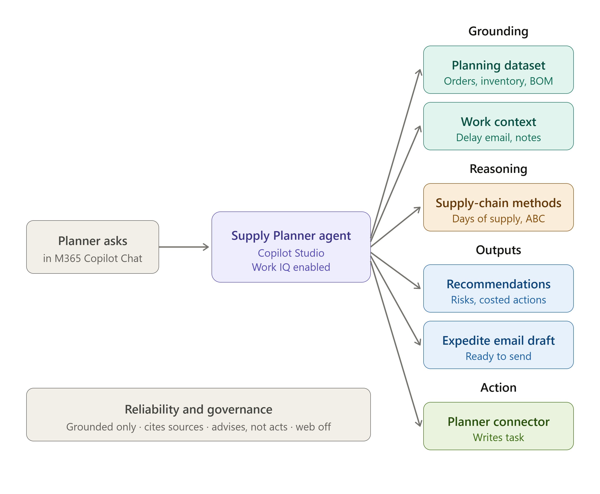

# Verdant Plate Supply Planner: Architecture

This document describes the architecture of the Verdant Plate Supply Planner. The diagram below (`architecture.png`) illustrates how the agent uses Microsoft 365 Copilot and Work IQ; the written flow follows underneath.

## Flow described in words

1. **Entry point**, The supply planner asks a question in Microsoft 365
 Copilot Chat.

2. **Agent**, The Verdant Plate Supply Planner, built in Copilot Studio,
 with Work IQ enabled as the intelligence layer.

3. **Grounding**, The agent answers only from grounded sources:
 - Planning dataset: orders, inventory, recipe BOM, suppliers, capacity
 - Work context: supplier delay email and planning meeting notes

4. **Reasoning**, The agent applies standard supply-chain methods:
 days of supply, reorder point, ABC / priority segmentation, lead-time.

5. **Outputs**
 - Risk analysis and costed recommendations (cited, ranked by severity)
 - Expedite email draft (ready to send to the backup supplier)

6. **Action**, A Planner connector lets the agent write the recommended
 action as a task (the agentic write-action / external integration).

7. **Reliability and governance (foundation)**, Grounded in data only,
 cites every source, advises rather than acts (no autonomous changes),
 web search off.

*All data and scenarios are fictional, for demonstration only.*
